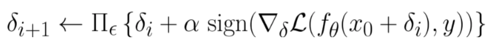

class: middle, center, title-slide

# Challenges on Adversarial Training for Videos

  
Kaleab A. Kinfu    
Mathematical Institute for Data Science  
Johns Hopkins University
---
class: middle

# Outline

- Show sensitivity of attack quality to PGD parameters (step size, number of iterations).
- Show linear relationship between attack strength and PGD step size
- Show that better attacks do not lead to better defenses, so need to choose suboptimal PGD parameters
- Show that there is a need for a schedule on the attack strength, with small epsilon in first epochs, and large epsilon later, to achieve better defenses for all epsilons.

---

class: middle

# Standard training:

We use the **3D-ResNext-101** model as a backbone for the video classification.​

- Pretrained on **Kinetics-400**

- Finetuned on **UCF-101 (64 chunks)​**

- Train accuracy: **top-1=90.98%**; *top-5=98.67%​*

- Test accuracy: **top-1=93.58%**;  *top-5=99.3%*​
---

class: middle

# Video attacks:​

- Attack is known at testing time​

- L∞ attacks: Projected Gradient Descent (PGD)​

  - Adversarial example:
    
  - Iterative perturbation:​
    
      - ‘i’ indicates the ith iteration; α is the step size.​
---

class: middle

# Sensitivity of PGD parameters 

<iframe src="pgd_loss_4_mean.html" style="height: 80%; overflow:hidden; width: 120%; margin-left: -100px;" frameborder="0" marginheight="1" marginwidth="1" scrolling="no" allowtransparency="true" seamless="seamless"></iframe>
---

class: middle

# Sensitivity of PGD parameters 

<iframe src="pgd_loss_8_mean.html" style="height: 80%; overflow:hidden; width: 120%; margin-left: -100px;" frameborder="0" marginheight="1" marginwidth="1" scrolling="no" allowtransparency="true" seamless="seamless"></iframe>

---
class: middle

# Sensitivity of PGD parameters 
## Relationship between attack strength and optimal PGD step size
<iframe src="PGD_optimal_step_size.html" style="height: 80%; overflow:hidden; width: 100%;" frameborder="0" marginheight="1" marginwidth="1" scrolling="no" allowtransparency="true" seamless="seamless"></iframe>

---
class: middle

# AT results 

- U:=U(0,12); rU:=U(12,0); αU:=U(2ε,α*); iU:=lU(1,15); lU:=lU(0,12)

<iframe src="PGD_loss_slider.html" style="height: 80%; overflow:hidden; width: 120%; margin-left: -50px;" frameborder="0" marginheight="1" marginwidth="1" scrolling="no" allowtransparency="true" seamless="seamless"></iframe>

---
class: middle

# Generalization gap 
- Model: CAL(ε~U,α=α*,i=5)

<iframe src="PGD_epoch_slider.html" style="height: 80%; overflow:hidden; width: 120%; margin-left: -50px;" frameborder="0" marginheight="1" marginwidth="1" scrolling="no" allowtransparency="true" seamless="seamless"></iframe>

---
class: end-slide, center
count: false

Thank you!