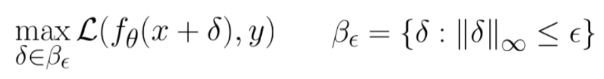

class: middle, center, title-slide

# Challenges on AT for Video

  
René Vidal  
Johns Hopkins University
---
class: middle

# Outline

- Show sensitivity of attack quality to PGD parameters (step size, number of iterations).
- Show linear relationship between attack strength and PGD step size
- Show that better attacks do not lead to better defenses, so need to choose suboptimal PGD parameters
- Show that there is a need for a schedule on the attack strength, with small epsilon in first epochs, and large epsilon later, to achieve better defenses for all epsilons.

---

class: middle

# Standard training:

We use the **3D-ResNext-101** model as a backbone for the video classification.​

- Pretrained on **Kinetics-400**

- Finetuned on **UCF-101-64​**

- Train accuracy: **top-1=90.98%**; *top-5=98.67%​*

- Test accuracy: **top-1=93.58%**;  *top-5=99.3%*​
---

class: middle

# Video attacks:​

- Attack is known at testing time​

- L∞ attacks: Projected Gradient Descent (PGD)​

  - Adversarial example:
    
  - Iterative perturbation:​
    
    - ‘i’ indicates the ith iteration; α is the step size.​
---

class: middle

# Sensitivity of attack quality to PGD parameters 

---

class: end-slide, center
count: false

Thank you!